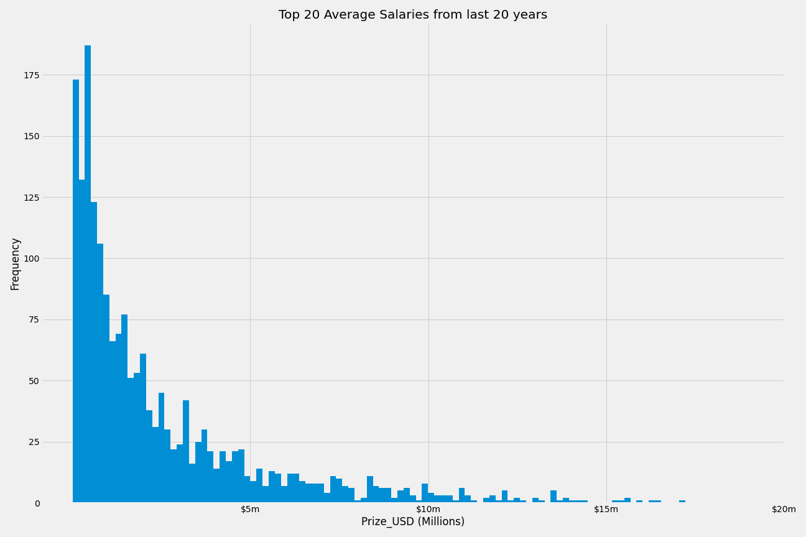
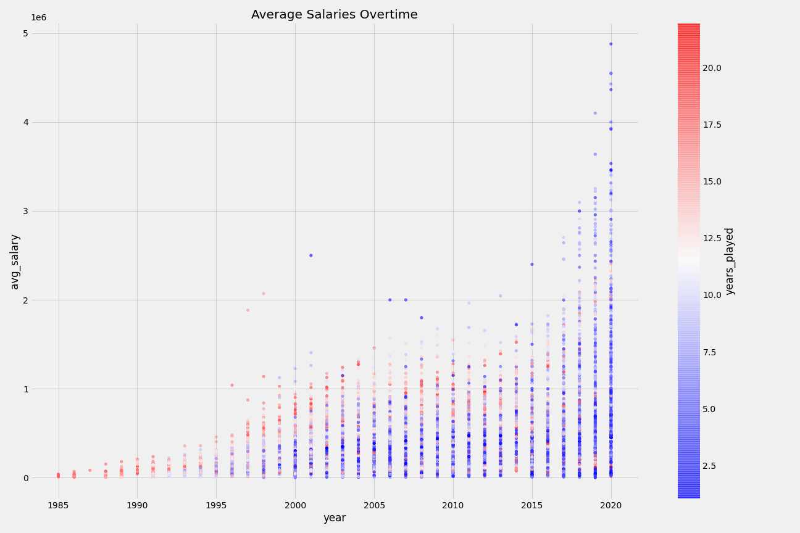
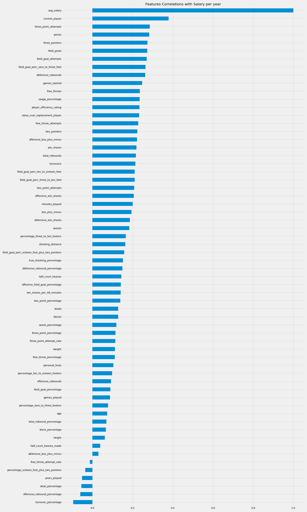
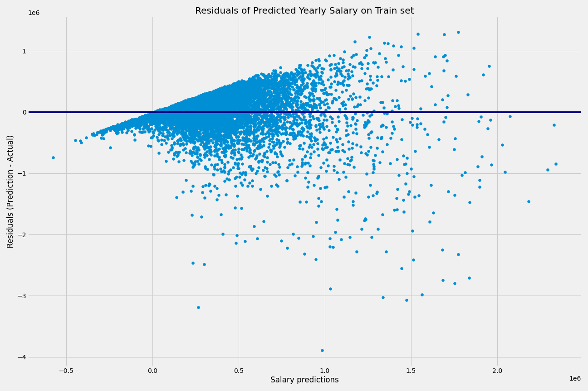
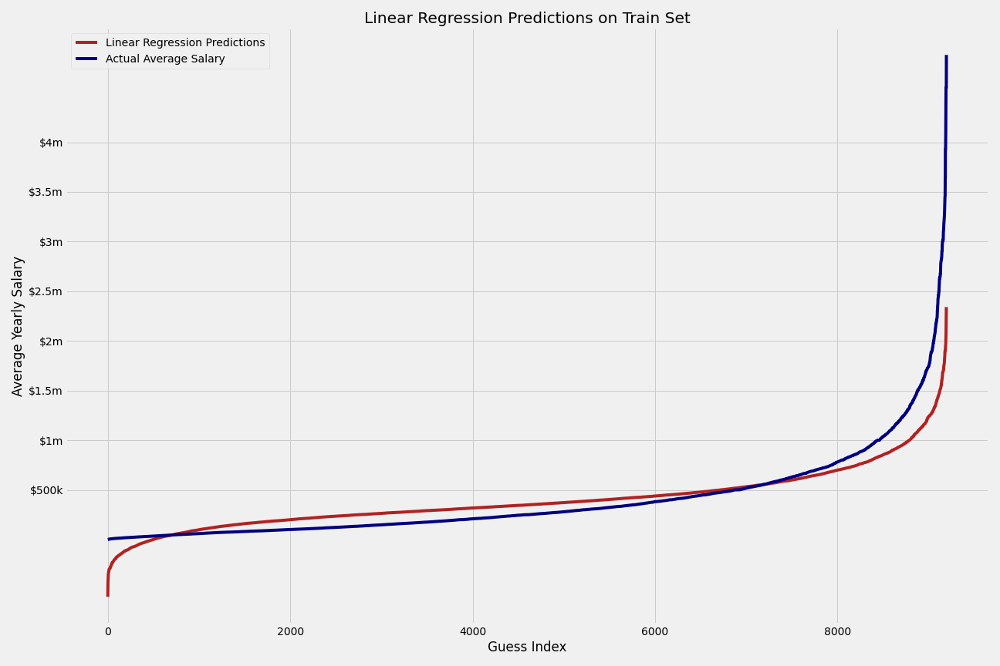
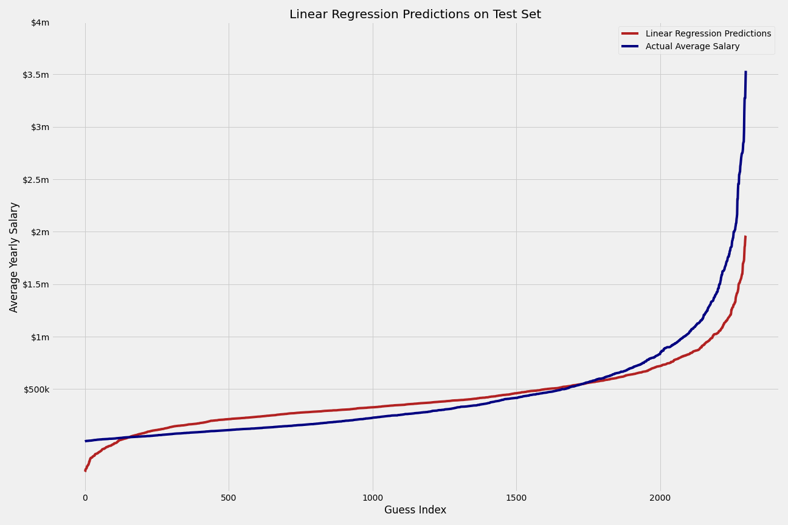
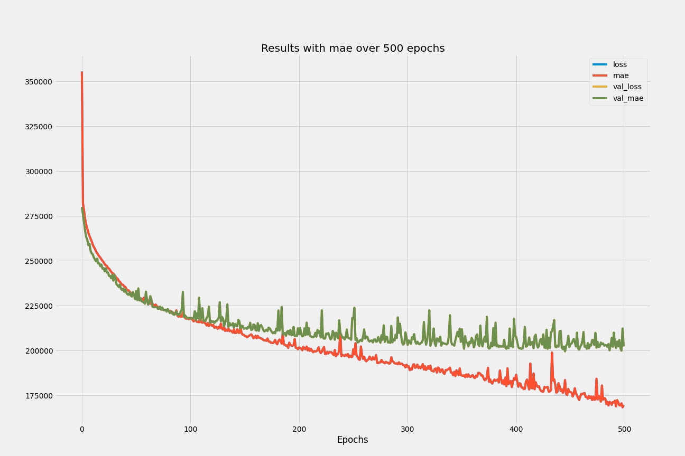
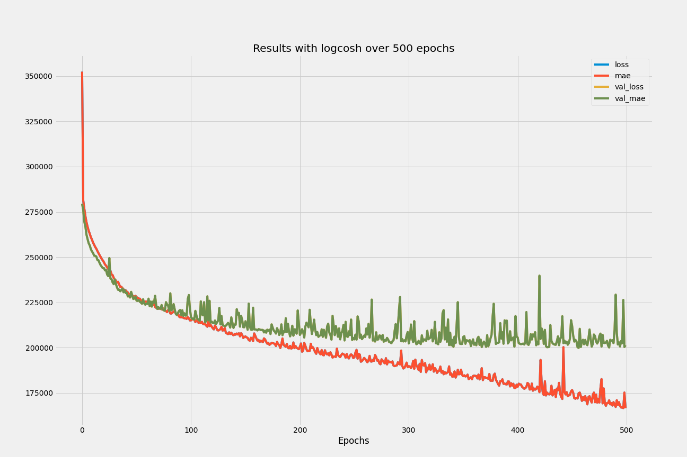
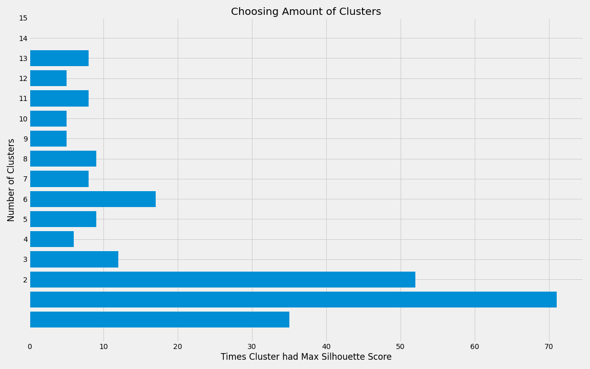

# NBA Salary Predictions

* **Goal**: Use different modeling techniques to try and accurately predict what the yearly salary of a player would be based on as many features as possible
  * **Hidden Goal**  - To be *that guy*  that uses advanced Machine Learning models to predict salary worth when a friend complains that the Bucks overpaid for a player

-------------

## Getting the Data

* Was able to get game/season stats using [Sports Reference API](https://sportsreference.readthedocs.io/en/stable/) that pulls from [Sportsreference.com](www.sports-reference.com) and it took ***a lot*** of wrangling to pull together
  * [Feature Descriptions](https://sportsipy.readthedocs.io/en/latest/nba.html#module-sportsipy.nba.player)

    > * Some strange categories that end with `_percentage` (besides `Field-Goals`) are referring to `{Stat} per 100 possessions`
    > * Features include: `assist_percentage`, `block_percentage`, `defensive_rebound_percentage`, `offensive_rebound_percentage`, `steal_percentage`, `total_rebound_percentage`, `turnover_percentage`, `usage_percentage`

-------------

## Exploratory Data Analysis

* These functions that were partially taken from this [Towards DataScience Article](https://towardsdatascience.com/sports-reference-api-intro-dbce09e89e52) and also modified by myself to get all the info I needed to create created two DataFrames:
  * Season DataFrame (**Mainly used this one**):

    > * 61 Columns (`29 null columns` that were removed)
    > * **Target Feature** = `Avg_Salary`
    > * `Salary` gives career earnings in total up to that season, so for the target value I divided the Salary by the amount of years played at that point
    > * 13,235 Rows (Season data for players: Vince Carter claims most with 22 years)
    > * 2,033 Unique Players

  * Career DataFrame (Used mostly for EDA):
  
    > * 61 Columns (`29 null columns` that were removed)
    > * 2,040 Rows
    > * 2,033 Unique Players (Down to 1923 players after removing players without salaries)

* Highest Paid:   LeBron James         $17.2M
* Lowest Paid:    Kirk Penney          $4.5K



### Trying to get an idea of what features contribute to a higher salary

* Showing average salaries over time:



* Features compared to Average Salary:


* Shown another way:



-------------

## Linear Regression

* Training:

  > * Mean absolute error = 240,457.84
  > * Mean squared error = 127,441,167,125.65
  > * Median absolute error = 172,839.44
  > * Explain variance score = 0.42
  > * R2 score = 0.42

* Residuals plot:



* Training Plot:



* Testing:

  > * Mean absolute error = 234,554.68
  > * Mean squared error = 123,912,975,078.46
  > * Median absolute error = 169,628.39
  > * Explain variance score = 0.44
  > * R2 score = 0.44

* Residuals plot ():


* Test Plot:



-------------

## Applying Neural Network to predict Salary of player

* Initially just tried a simple DNN that used 3 Dense `Relu` layers and `msle` as log function, ran over 10,000 epochs, results are shown below:


* Then tried running multiple DNN's using the following loss Functions:

```python
loss_functions = ['mae', 'mse', 'mape', 'msle', 'huber', 'logcosh']
```

* Model features (`first_hidden` is 20% of the numbers of rows in `X_train`):

```python
def build_and_compile_model(loss):
  model = keras.Sequential([
      layers.Dense(first_hidden, activation='relu', input_shape=[X_train.shape[1]]),
      layers.Dense(first_hidden//4, activation='relu'),
      layers.Dense(first_hidden//16, activation='relu'),
      layers.Dense(first_hidden//32, activation='relu'),
      layers.Dense(first_hidden//64, activation='relu'),
      layers.Dense(1, activation='linear')
  ])

  model.compile(loss=loss,optimizer=tf.keras.optimizers.Adam(0.0001),
                metrics=['mae'])
  return model
```

* Results of Training over 500 epochs:

```python
mae had a final val_loss of 202289.53125

mse had a final val_loss of 142236286976.0 # Squared error: 377,142.26

mape had a final val_loss of 68.57567596435547 # Percentage

msle had a final val_loss of 154.00787353515625 # Log error

huber had a final val_loss of 219148.109375

logcosh had a final val_loss of 201331.84375
```

* `Log_cosh` ends up slightly edging out the with it's final val_loss over mae





* In practice it seems that these models consistently predict about `7 times less` than actual for your average player & up to `18 times less` for those outlier players with a **super max** deal

-------------

## Who shall we test with?

-------------

## Conclusions

* Without doing things like **clustering**, identifying **salary limitations** of the team that the player is on and **removing outliers** it's a bit hard to make a super accurate prediction
* A DNN will make a more accurate prediction than simple linear regression, however for most players it's really not going to make a reasonable difference

## References

* Used functions to create DataFrames from this [Towards DataScience Article](https://towardsdatascience.com/sports-reference-api-intro-dbce09e89e52)

* Players that are not currently playing do not have contract data, but can find contracts using [spotrac](https://www.spotrac.com/nba/)

-------------

## If only I had more time...

* Cluster NBA players into different positional categories based off season stats, then train Neural Network to predict something like win percentage (or perhaps have it categorize into something like [`Great Team`, `Good Team`, `Okay Team`, `Bad Team`, `Awful Team`])
  * Unfortunately the results I was getting using `KMeans Clustering` don't make any sense to me. Tried using both *career totals*, *per game averages* and *scaling the data*, but KMeans was suggesting between 2-3 clusters & decided that wouldn't make for a good proof of concept, hence the pivot to salary predictions
  * Regardless, here are some Scree Plots I'd created using `PCA`:


* And one of many Horizontal Bar Charts of the most common suggestions of clusters


